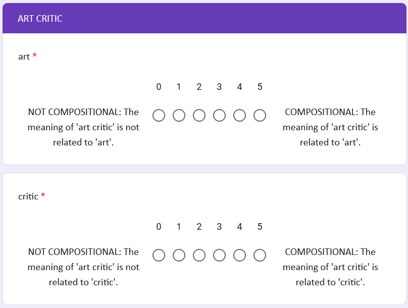

# Compositionality Ratings
This folder contains files from annotating 200 English noun-noun compounds with compound-constituent compositionality ratings. The ratings have been collected from December 2024 to February 2025 using the Prolific platform. The set of compounds has been split into 8 batches. For each compound-constituent pair 15 annotators provided a rating on a scale between 0 (definitely opaque) and 5 (definitely transparent).  
For anonymity reasons, Prolific worker-ids are replaced by new ids.

## Survey instructions
* Participants were asked to evaluate the extent to which the overall meaning of a compound noun can be related to the meanings of its parts. 
* For each compound a separate page is shown. 
* For each noun-noun compound participants are asked for a modifier- and a head-rating by letting them select values on a scale.

Example for "art critic":



## Participant criteria
* 1st language and earliest language in life: English
* One of the following participant locations: UK, Ireland, USA, Australia
* Approval rate: 90-100

## Response quality assurance
* In order to maintain response quality, participants also need to pass certain control instances. 
* Control instances: Here participants are instructed to select the listed value on the scale.
* For each rejected participant, a replacement participant was added to complete the survey.

## Result
* Results are processed into a csv file with one averaged rating per line.
```bash
compound,const,mean,stand_dev
arcade game,arcade,3.4,1.8822478962286404
arcade game,game,4.533333333333333,1.1254628677422756
...
```

## Overview
* ``RawRatings``: Contains batch-wise the judgements of workers in a nice format. On each line a file lists the compound-constituent pair, along with the (new!) worker id and the provided judgement. 
    * ``judgements_into_ratings.py``: Allows to merge the batched judgements into one file that only provides the compound-constituent pair along with the averaged rating.
* ``compositionality_ratings.csv``: Contains the averaged compound-constituent pair ratings, along with the standard deviation. (One compound-constituent rating per line, for all 200 compounds.)
* ``example-question_artcritic.png``: Example question from google form when asking for compound-constituent ratings related to the compound "art critic".